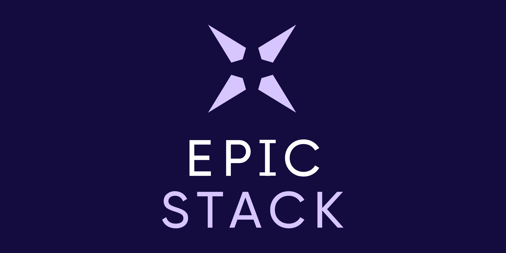

import {
  SquarePen,
  Image as ImageIcon,
  Wrench,
  Code,
  Sparkles,
  SwatchBook,
  ChevronRight,
  Info,
  Star,
  Rocket,
  Lightbulb,
} from 'lucide-react'
import Card from '../../components/Card.astro'
import CardGrid from '../../components/docs/CardGrid.astro'
import GroupName from '../../components/docs/GroupName.astro'
import ExternalLink from '../../components/docs/ExternalLink.astro'

<GroupName>Getting Started</GroupName>

## Introduction

Ditch analysis paralysis and start shipping Epic Web apps.

The goal of The Epic Stack is to provide solid opinions for teams to hit the ground running on their web applications. We recommend you watch <ExternalLink url='https://www.epicweb.dev/talks/the-epic-stack'>Kent's introduction</ExternalLink> to the Epic Stack to get an understanding of the "why" behind the Stack.

## About the Epic Stack

<CardGrid>
  <Card
    header='Guiding principles'
    content='The guiding principles behind the Epic Stack.'
    href='/introduction/guiding-principles'
    withIcon>
    <Lightbulb className='stroke-primary' />
  </Card>
  <Card
    header='Decisions'
    content='The reasoning behind various decisions made for the Epic Stack. A good historical record.'
    href='https://github.com/epicweb-dev/epic-stack/tree/main/docs/decisions'
    withIcon>
    <Rocket className='stroke-primary' />
  </Card>
</CardGrid>

## Best Places to Start

<CardGrid>
  <Card
    header='Getting started'
    content='Instructions for how to get started with the Epic Stack.'
    href='/introduction/getting-started'
    withIcon>
    <Info className='stroke-primary' />
  </Card>
  <Card
    header='Features'
    content='List of features the Epic Stack provides out of the box.'
    href='/introduction/features'
    withIcon>
    <Star className='stroke-primary' />
  </Card>
  <Card
    header='Deployment'
    content='The manual steps you can follow to get things up and running.'
    href='/deployment-operations/deployment'
    withIcon>
    <Rocket className='stroke-primary' />
  </Card>
  <Card
    header='Examples'
    content='Examples of the Epic Stack with various tools.'
    href='/miscellaneous/examples'
    withIcon>
    <Code className='stroke-primary' />
  </Card>
</CardGrid>
