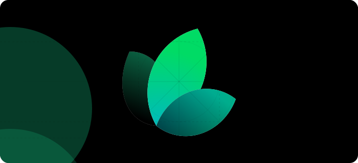

import {
  SquarePen,
  Image as ImageIcon,
  Wrench,
  Code,
  Sparkles,
  SwatchBook,
  ChevronRight,
} from 'lucide-react'
import Card from '../../components/Card.astro'
import CardGrid from '../../components/docs/CardGrid.astro'
import GroupName from '../../components/docs/GroupName.astro'

<GroupName>Getting Started</GroupName>

## Introduction

Welcome to the home of your new documentation

## Setting up

The first step to world-class documentation is setting up your editing environments.

<CardGrid>
  <Card
    header='Edit Your Docs'
    content='Get your docs set up locally for easy development'
    withIcon>
    <SquarePen className='stroke-primary' />
  </Card>
  <Card
    header='Preview Changes'
    content="Preview your changes before you push to make sure they're perfect"
    withIcon>
    <ImageIcon className='stroke-primary' />
  </Card>
</CardGrid>

## Make it yours

Update your docs to your brand and add valuable content for the best user conversion.

<CardGrid>
  <Card
    header='Customize Style'
    content="Customize your docs to your company's colors and brands"
    withIcon>
    <SwatchBook className='stroke-primary' />
  </Card>
  <Card
    header='Reference APIs'
    content='Automatically generate endpoints from an OpenAPI spec'
    withIcon>
    <Code className='stroke-primary' />
  </Card>
  <Card
    header='Add Components'
    content='Build interactive features and designs to guide your users'
    withIcon>
    <Wrench className='stroke-primary' />
  </Card>
  <Card
    header='Get Inspiration'
    content='Check out our showcase of our favorite documentation'
    withIcon>
    <Sparkles className='stroke-primary' />
  </Card>
</CardGrid>
